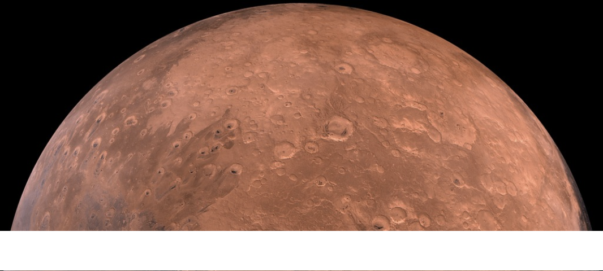

# Mission-to-Mars

## Overview
In this project, the goal was to scrape data from across multiple websites and compile the data into a new web application. To achieve this, we navigated through html formatting and used BeautifulSoup and Splinter to pull full-resolution images, titles, news headlines, and facts about Mars.

## Tools
To accoplish this, we used:
- Jupyter Notebook
- Python
- BeautifulSoup
- Splinter
- MongoDB